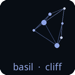

# Technical Reference

This page documents the exact algorithms, byte layouts, and formulas used by Tychons. It is intended for implementers and anyone who needs to verify conformance with the [full specification](https://github.com/cwlls/tychons/blob/main/docs/src/tychons-spec-v0.1.0.md).

For a conceptual overview, see [How It Works]().

---

## Key Derivation

All parameters are derived using **BLAKE3 in derive-key mode**:

```
output = BLAKE3_derive_key(context_string, key_bytes)
```

Where `key_bytes` is the public key string encoded as UTF-8 bytes.

### Fallback: HMAC-SHA256

Implementations without BLAKE3 may substitute HMAC-SHA256 using the public key bytes (concatenated with a 4-byte big-endian counter) as the HMAC key and the context string as the message (HKDF-like pattern). Output longer than 32 bytes is produced by incrementing the counter and concatenating results. This produces different output and is not interoperable with BLAKE3-based implementations.

### Context Strings

These exact ASCII strings must be used:

| Context string | Output length | Purpose |
|---|---|---|
| `"tychons v1 hue"` | 4 bytes | Hue derivation |
| `"tychons v1 stars"` | 64 bytes | Star parameters |
| `"tychons v1 word_1"` | 4 bytes | First checksum word |
| `"tychons v1 word_2"` | 4 bytes | Second checksum word |

The `"tychons v1"` prefix domain-separates the protocol and allows future versioning.

### Byte-to-Scalar Conversion

A single byte `b` becomes a float:

```
scalar = b / 255.0    # range [0.0, 1.0]
```

Multi-byte values are decoded as big-endian unsigned integers:

```
value = int.from_bytes(bytes, byteorder="big", signed=False)
```

---

## Hue Derivation

Derive 4 bytes from context `"tychons v1 hue"`. Interpret as a uint32 and reduce modulo 360:

```
hue = uint32(derived_bytes) % 360
```

The hue is shared by all stars and edges in the badge.

---

## Star Derivation

Derive 64 bytes from context `"tychons v1 stars"`. Convert all 64 bytes to scalars in [0, 1].

### Star Count

```
n = 6 + floor(scalars[0] * 4.99)    # n in {6, 7, 8, 9, 10}
```

### Per-Star Parameters

For each star `i` in `[0, n)`, read 5 scalars starting at index `1 + i * 5`, wrapping modulo 64:

| Scalar | Parameter | Formula | Range |
|---|---|---|---|
| `scalars[idx]` | x position | `star_x0 + scalar * star_w` | [div, 9*div] |
| `scalars[idx+1]` | y position | `star_y0 + scalar * star_h` | [div, 6.5*div] |
| `scalars[idx+2]` | radius | `size*0.012 + scalar * (size*0.035 - size*0.012)` | [1.536, 4.48] px at size=128 |
| `scalars[idx+3]` | brightness | `0.45 + scalar * 0.55` | [0.45, 1.0] |
| `scalars[idx+4]` | neighbor count | `1 + floor(scalar * 2.99)` | {1, 2, 3} |

### Layout Constants — 10-Division Grid Model

The canvas is divided into 10 equal divisions in each axis:

```
div = size / 10

pad = div                          (1 division from each edge)
star zone x: [div, 9*div]          (8 divisions wide)
star zone y: [div, 6.5*div]        (5.5 divisions tall, from top)
label zone y: [6.5*div, 9*div]     (2.5 divisions tall)

star_w = 8 * div
star_h = 5.5 * div
label_h = 2.5 * div
```

At size=128: `div = 12.8px`, `star zone` is `102.4 × 70.4 px`, `label zone` is `102.4 × 32.0 px`.

All values scale proportionally with badge size.

---

## Edge Computation

Edges use a nearest-neighbor algorithm:

1. For each star `i`, compute Euclidean distances to all other stars.
2. Sort by ascending distance.
3. Connect star `i` to its `k` nearest neighbors, where `k` is the star's derived neighbor count.
4. Deduplicate: store each edge as `(min(i, j), max(i, j))` in a set.

---

## Checksum Word Derivation

For each word, derive 4 bytes from its context, interpret as uint32, and reduce modulo the wordlist length `W`:

```
word_1 = wordlist[ uint32(derive("tychons v1 word_1", key)) % W ]
word_2 = wordlist[ uint32(derive("tychons v1 word_2", key)) % W ]
```

The two words must come from independent derivations. Deriving both from a single hash output is non-conformant.

---

## Color Model

### Background

Fixed: `RGB(8, 13, 20)` -- dark navy.

### Star Color

```
lightness = 0.60 + brightness * 0.28    # range [0.60, 0.88]
color = HSL(hue, saturation=0.65, lightness)
```

### Edge Color

```
mid_brightness = (star_i.brightness + star_j.brightness) / 2
lightness = 0.50 + mid_brightness * 0.25    # range [0.50, 0.75]
alpha = 0.30 + mid_brightness * 0.40        # range [0.30, 0.70]
color = HSLA(hue, saturation=0.50, lightness, alpha)
```

### Label Color

```
color = HSLA(hue, saturation=0.55, lightness=0.72, alpha=0.86)
```

### HSL to RGB

Standard CSS Color Module Level 3 conversion. The reference implementation includes a manual conversion function.

---

## Rendering Pipeline

1. **Canvas:** Create an RGBA image at `2 * size` pixels (2x supersampling).
2. **Background:** Draw a filled rounded rectangle with corner radius `~ size / 10` (scaled to 2x), filled with `RGB(8, 13, 20)`.
3. **Edges:** On a separate RGBA layer, draw each edge as a line segment between its endpoint star coordinates (scaled to 2x). Line width `size * 0.008` (= `1.024px` at size=128), scaled to 2x. Alpha-composite the edge layer onto the main image.
4. **Stars:** Draw each star as a filled circle at its position (scaled to 2x) with the derived radius (scaled to 2x).
5. **Gradient:** Draw a fade from transparent to the background color over the label zone (bottom 25% of canvas), for label contrast.
6. **Label:** Render `"word_1  ·  word_2"` centered horizontally near the bottom. Font size = `label_h * 0.60 / 1.20` (= `~16px` at size=128, where `label_h = 2.5 * div`). The interpunct is U+00B7.
7. **Downsample:** Resize from `2 * size` to `size` using Lanczos filtering.
8. **Mask:** Apply a rounded rectangle alpha mask (corner radius ~12px at size=128) so the badge has transparent corners.

---

## Test Vectors


*"ssh-rsa AAAAB3NzaC1yc2E"*

---

## Full Specification

The complete formal specification is maintained at [`docs/src/tychons-spec-v0.1.0.md`](https://github.com/cwlls/tychons/blob/main/docs/src/tychons-spec-v0.1.0.md) in the repository.
